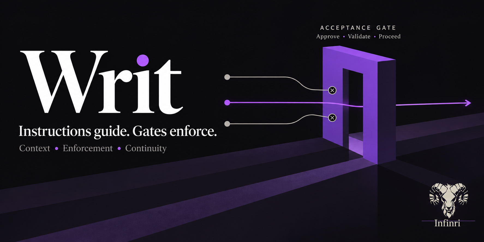

# Writ

[](LICENSE)
[](pyproject.toml)
[](https://buymeacoffee.com/infinri)

Writ turns supported workflow requirements into executable checks and acceptance gates for Claude Code, instead of relying on the model to follow written instructions. It runs on your machine: hooks that Claude Code calls around each tool use, a local daemon that makes the decisions, and a Neo4j database in Docker that stores rules and decision records.



[Quick start](#quick-start) · [Acceptance gates](#acceptance-gates) · [Why was I blocked?](docs/install.md#why-was-i-blocked) · [Documentation](#documentation) · [Support Writ](#support-writ)

## The problem, and the approach

A rule in `CLAUDE.md`, a skill or a system prompt is an instruction: the model has to find it, keep it through a long session, and decide it applies. When context compacts or fills, instructions fade, and nothing announces it.

Writ moves selected requirements out of the prompt and into code that runs when the agent acts. A source write before an approved plan is refused, not discouraged.

Context delivers the rules, methodology and past decisions that fit the current prompt, file and workflow phase. Enforcement checks each attempted action and blocks it, asks you, or reports a finding. Continuity records what you approved and why files changed, so the next session starts from it.

Writ constrains a cooperative agent; it is not a sandbox. See [Evidence and limits](#evidence-and-limits). The longer argument is in [`docs/instructions-vs-enforcement.md`](docs/instructions-vs-enforcement.md).

## Acceptance gates

Work mode puts two acceptance gates between a request and the first source write: an approved plan, then approved test skeletons. Each gate is code that runs when the agent tries to write and again when you approve. Only your own reply opens a gate.

### The gates at a glance

| Gate | Requires | Checked when | Blocks | Satisfied by |
|---|---|---|---|---|
| Mode `[ENF-GATE-MODE]` | A declared mode | Every write (Write, Edit, NotebookEdit, shell writes) | All writes except `plan.md`, `capabilities.md` and exempt paths | Auto-route on a clearly build- or research-shaped prompt, or `writ mode set <mode> <session_id>` (the refusal prints the command with your session id) |
| Plan gate `phase-a` `[ENF-GATE-PLAN]` | `plan.md` (in `.claude/plans/<session_id>/`, else the project root) with `## Files`, `## Analysis`, `## Rules Applied` (only rule ids Writ injected this session, or "No matching rules") and `## Capabilities` (unchecked boxes) | Each write, and the validator when you reply | Every write except tests, migrations, `__init__.py`, `.claude/` markdown, `plan.md`, `capabilities.md` and the OS temp directory | The agent asks "Say approved to proceed.", you reply `approved`, the validator passes; the phase moves from planning to testing |
| Test-skeleton gate `test-skeletons` `[ENF-GATE-TEST]` | A test file with a test signature (`def test_`, `it(`, `test(`, `@Test`, ...), written this session or named in the plan's `## Files`; or a manual-testing grant you typed (`manual test approved`) | Same | Same | Same; the phase moves from testing to implementation |
| Drift `[ENF-GATE-DRIFT]` | `plan.md` unchanged since it was approved (ticking a capability box does not count) | Every write | Every write except the exempt paths (tests, migrations, `plan.md`, `.claude/` markdown); scratch files in the OS temp directory are refused too | One fresh `approved` |
| Plan freeze (implementation phase, tagged `[ENF-GATE-PLAN]`) | `plan.md` is not edited | Writes to `plan.md` | `plan.md` | Reply `replan approved` (returns to planning and clears both gates) |
| Project boundary `[ENF-PROJECT-BOUNDARY]` | The path is inside the project root, or declared by absolute path in `## Files` | Writes in Work mode | Writes outside the project (the OS temp directory is exempt) | Declare the path, then approve again (the edit re-arms the gates) |
| Debug root cause `[DEBUG-GATE-ROOT-CAUSE]` (debug mode) | A populated `## Root cause` in `.claude/debug/<session_id>/debug.md` | Source writes | Source edits | Write the root cause |
| Credentials `[SEC-CREDENTIAL-WRITE]` (every mode, before every exemption) | Not a credential path (`.env`, `*.key`, `*.pem`, `~/.ssh/`, ...) | Every write | Credential paths | Nothing the agent can do; you write those files yourself. Unlike other refusals, this one never turns into a confirmation prompt |

The test-skeleton gate checks that a test exists, not what it asserts. A separate check, ENF-PROC-TDD-001, refuses whole-file writes of source files under `src/`, `lib/` or `app/` until a conventional test file with assertion markers exists.

### An example, start to finish

Illustrative session. Lines starting with `[` and the fenced refusals are the exact strings Writ prints, copied from the source; the rest is abbreviated.

1. You ask: "Add a `slugify()` helper to `src/textutil.py`, with tests." Writ prints the line below, and the session starts in the `planning` phase.

   ```text
   [Writ: implementation request -> work mode set automatically]
   ```

2. The agent tries to write `src/textutil.py`. The write is refused:

   ```text
   [ENF-GATE-PLAN] ALL writes blocked -- plan not yet approved. DO NOT attempt more writes.
   Present your plan to the user and say: "Say approved to proceed."
   Wait for the user to say "approved" before attempting ANY file writes.
   ```

3. The agent writes `.claude/plans/<session_id>/plan.md` (allowed) and ends its turn with "Say approved to proceed."
4. You read the plan and reply `approved`. Writ prints the two lines below; the angle-bracket parts vary.

   ```text
   [Writ: planning gate approved -> testing] (advanced by the approval hook on your confirmation; no agent self-approval)
   [Writ: validated <path to plan.md> (project root from <how it was found>)] (if that is not the plan you meant to approve, the project root is wrong: invalidate the gate before continuing)
   ```

5. The agent tries the source file again and is refused:

   ```text
   [ENF-GATE-TEST] ALL writes blocked -- test skeletons not yet approved. DO NOT attempt more writes.
   Write test skeleton files first (test files ARE allowed), present them to the user, and say: "Say approved to proceed."
   ```

6. The agent writes `tests/test_textutil.py` containing `def test_slugify_...` and asks: "Test skeletons written: test_textutil (3 tests). Say approved to proceed." You reply `approved`, and Writ prints:

   ```text
   [Writ: testing gate approved -> implementation] (advanced by the approval hook on your confirmation; no agent self-approval)
   ```

7. The agent writes `src/textutil.py`; it is allowed. Credential paths and paths outside the project stay refused.
8. What is recorded: each refusal and approval is a row on the audit stream (`gate_denial`, `phase_advance`) in `~/.local/state/writ/logs/<project>/audit.jsonl`, and `writ audit-session <session_id>` prints the timeline. Approving the plan snapshots it as a Decision; when you commit, the post-commit hook links the commit, each changed file, the reason the plan gave for it and the rules the agent was shown. `writ recall` reads it back, and the next session's first prompt carries it as a briefing.

### When the plan changes after approval

Approvals are bound to the plan's fingerprint. Editing `plan.md` after approving it re-arms the gates; the next write is refused with:

```text
[ENF-GATE-DRIFT] ALL writes blocked -- plan.md changed after it was approved, so the approval for phase-a no longer covers it. DO NOT attempt more writes.
Tell the user what changed and say: "Say approved to proceed."
One fresh approval re-binds the gates to the current plan. Ticking a capability box is not a change and never causes this.
```

Review the change; the agent asks again and one `approved` re-binds the gates.

During implementation `plan.md` itself is frozen. To change it, reply `replan approved`: the session returns to planning with both gates cleared, and source writes wait for both approvals again.

What counts as an approval: `approved` works only as your whole message (case and a trailing `.`, `!` or `,` are ignored), and only when the agent's previous turn asked for it with `say approved`, `reply approved`, `type approved` or `approved to proceed`. Otherwise nothing advances and Writ prints:

```text
[Writ: approval detected with no request in front of it, nothing was advanced]
```

If you meant it, reply `approved anyway`; that waives the request check and is recorded on the audit stream (`approval_evidence_override`). Approvals also end on `writ mode set`, and when a commit lands the last file the approved plan declared.

### Why the agent cannot approve itself

Your reply is read by a hook on Claude Code's prompt-submit event, which mints a single-use token bound to the pending gate and the plan's fingerprint. Advancing a gate claims that token. The agent has no way to mint one, the token and session-state files are write-protected (`[ENF-GATE-STATE]`), and a tokenless attempt is refused and logged as `agent_self_approval_blocked`. `/writ-approve` sends the same token through a slash command; it cannot create one. The full contract is in [`docs/reference/session-and-gates.md`](docs/reference/session-and-gates.md).

## Quick start

1. Check prerequisites: Linux or macOS, Claude Code, Python 3.11 or newer (`python3 --version`), and Docker with its daemon running (`docker info`). `git` is needed only for a clone install; `jq` and `curl` are optional. Neo4j wants about 1 GB of memory, and the install needs network access once, to download packages and the embedding model.
2. Install the plugin:

   ```shell
   claude plugin marketplace add infinri/Writ
   claude plugin install writ@writ
   ```

3. Open Claude Code in any project. Writ prints one command on its own line, `bash <plugin root>/scripts/bootstrap-plugin.sh`; run it in a terminal (add `--preflight` to only check prerequisites). It creates the venv, starts Neo4j, sets a private database password, loads the rules, starts the daemon, and patches `~/.claude/settings.json`, `~/.claude/CLAUDE.md` and the slash commands. It is idempotent; re-running it is the update.
4. When it prints `Writ plugin is ready` and `! Restart Claude Code for the hooks to take effect.`, restart Claude Code.
5. Check health, using the `Plugin root` line from the banner:

   ```shell
   "<plugin root>/bin/writ" status
   "<plugin root>/bin/writ" doctor
   ```

   Success: `status` prints JSON with `"status": "healthy"`, `"index_state": "warm"` and a non-zero `"rule_count"`; `doctor` prints a `STATUS  NAME  DETAIL` table and exits 0 when no row is `fail`. `Service not running. Start with: writ serve` means the daemon is down. In Claude Code the status bar shows `Writ ctx <n>%`, and a prompt carries a `--- WRIT RULES (...) ---` block or a `[Writ: no matching rules found for this task. ...]` line. Inside Claude Code the plugin's `bin/` is on the Bash tool's PATH, so the agent can run `writ status` directly.
6. Next: give it a task (auto-route sets the mode), or declare one with `writ mode set <conversation|debug|investigate|review|work> <session_id>`. Once the repository is a registered project (approving a plan there, or a captured commit, registers it), `writ docs ingest --repo <repo root>` makes its docs, ADRs and READMEs retrievable.

Cloning instead, or something failed? [`docs/install.md`](docs/install.md) covers the clone install (`bash scripts/bootstrap.sh`), updates, the systemd service and troubleshooting.

## Your first task

1. Open Claude Code in a git repository and describe a change.
2. Read the plan the agent presents, and reply `approved` only if it is right.
3. Read the test skeletons, and reply `approved`.
4. Let it implement. The agent dispatches the read-only `writ-reviewer`; a CRITICAL finding turns `git commit` into a confirmation until it is fixed and re-reviewed.
5. Commit. `writ recall` then shows the recorded decision.

The other modes (`conversation`, `review`, `investigate`, `debug`) have no plan or test gates; `debug` refuses source edits until a root cause is written.

## How Writ works: context, enforcement, continuity

The daemon is Writ's local server process (`writ serve`, on `http://localhost:8765` and a private unix socket) that the hooks call for retrieval, session state and gate decisions.

### What Writ can do to a tool call

| Kind | What happens | Examples |
|---|---|---|
| Blocking check | The tool call is refused | The gates above, credential paths, the project boundary, the debug gates, `[ENF-IRREVERSIBLE]` destructive commands, `[ENF-GATE-STATE]`, the pre-write static checks `[ENF-POST-007]` and `[ENF-POST-008]`, ENF-PROC-TDD-001, `[ENF-TOOL-BUDGET]`, sub-agent scope, a `git worktree add` into an un-ignored path inside the project, and unresolved rule violations at the end of a Work-mode turn |
| Approval request | Claude Code asks you to confirm | `git commit` with unresolved CRITICAL reviewer findings, a shell write whose target cannot be resolved, outbound data to a host not on your allowlist, a worktree target Writ cannot resolve, a gate refused repeatedly, a decision helper that crashed |
| Advisory finding | Reported; nothing is refused | Post-write validators, failing marked tests, a quality self-score under 3, the reply style check, investigate-mode checks, `writ doctor`, `writ trust-ledger`; the read-size check only records, unless `WRIT_READ_JUNK_GATE=enforce` makes it block |
| Context delivery | Text is added to the model's context | The items under Context below |

The three end-of-turn checks for tests, quality scores and reply style exit with status 1, which Claude Code treats as a non-blocking hook error, so they report rather than stop the turn.

### Context

Each prompt gets up to five sections, within 9,500 tokens: ranked rules, the always-on floor, methodology, decision recall and project documents. Mandatory rules are never ranked; they arrive on the always-on floor. Ranked retrieval abstains, returning nothing, when the best raw cosine is under 0.30. At write time Writ adds the rules for that file, plus the decision behind the file's last change, open questions about it and files that usually change with it.

Rules are context, not enforcement: a rule is text the model reads. What refuses an action is the fixed set of hooks above, which does not change when you add, edit or remove a rule. Agent proposals are stored provisional and are still injected; promoting one needs your approval token. See [`docs/reference/retrieval.md`](docs/reference/retrieval.md#8-custom-rules-and-what-enforces-them).

### Enforcement

Hooks run on Claude Code events (the generated list is [`docs/reference/hooks.md`](docs/reference/hooks.md)). The mode decides which checks apply:

| Mode | Use it for | What it adds |
|---|---|---|
| `conversation` | Discussion and questions | No workflow gates |
| `review` | Evaluating code against the rules | No workflow gates; review guidance |
| `investigate` | Research and codebase exploration | Records web citations and command evidence; its checks report |
| `debug` | Diagnosing one failure | Refuses source edits until a root cause is written, and source reads until evidence is recorded |
| `work` | Building or changing code | The plan and test-skeleton gates |

If the daemon does not answer, the write hooks run the same check locally from the session file. Only when no verdict can be obtained at all does a write proceed; `WRIT_STRICT=1` refuses it instead (write path only). Credential refusals and gate-state protection need no daemon. Approvals fail visibly while the daemon is down. Details: [`docs/reference/session-and-gates.md`](docs/reference/session-and-gates.md).

### Continuity

- Decision memory: `writ recall`, git notes on `refs/notes/writ-decisions`, and PR comments through `writ pr sync` (Bitbucket Cloud only).
- Auto-memory mirror: `writ memory backfill`, `writ memory list` and `writ memory audit`. It holds each memory's latest contents, not its history.
- Compaction handoff: `.claude/handoffs/session-<id>.md`, best effort.
- Open questions: `writ question open`, `list`, `answer` and `close`.
- Project documents: `writ docs ingest`.

All of these are keyed by project; the shared rulebook is cross-project. See [`docs/reference/decision-memory.md`](docs/reference/decision-memory.md#continuity-at-a-glance).

## Evidence and limits

### Implemented and testable

The gates, the approval binding, the credential classifier, the project boundary and the compaction handoff are code in this repository. Read them in source and trigger them yourself; [`docs/reference/session-and-gates.md`](docs/reference/session-and-gates.md) names where each one lives.

### Measured

Retrieval ranking and abstention, measured 2026-10-07 on the isolated test graph against a maintainer-authored gold set: 193 queries, of which 169 target rules the ranked channel can return and 47 are deliberately ambiguous, plus 20 negative queries that should get nothing. 95% bootstrap intervals (Wilson for false injection).

| Metric | Shipped configuration (abstention at 0.30) | Without the abstention gate |
|---|---|---|
| hit@5 (n=169) | 0.929 [0.888, 0.965] | 0.941 [0.905, 0.970] |
| MRR@5, ambiguous (n=47) | 0.603 [0.486, 0.716] | 0.635 [0.521, 0.743] |
| nDCG@10 (n=169) | 0.832 [0.789, 0.873] | 0.844 [0.803, 0.881] |
| False injection (n=20) | 4 of 20, 0.20 [0.08, 0.42] | 20 of 20 |

Twenty negatives is a small set; the interval is wide.

Latency, retrieval alone, warm in-process indexes, one laptop: 1.02 ms p95 over the 193 gold queries (2026-08-05, 287-rule corpus) and 0.827 ms p95 in a synthetic 10,000-rule run (2026-08-01).

These measure whether the right rule is ranked and whether nothing is injected when nothing fits. They do not measure code quality, rule compliance, or whether agents behave better. Sources: [`SCALE_BENCHMARK_RESULTS.md`](SCALE_BENCHMARK_RESULTS.md), [`benchmarks/ITEM5-PHASE234-RANKING-2026-10-07.md`](benchmarks/ITEM5-PHASE234-RANKING-2026-10-07.md), [`benchmarks/CLEAN-REWORD-2026-10-06.md`](benchmarks/CLEAN-REWORD-2026-10-06.md), [`benchmarks/THRESHOLD-SWEEP-2026-10-06.md`](benchmarks/THRESHOLD-SWEEP-2026-10-06.md).

Retrieval-quality figures published before 2026-08-06 were single draws from a nondeterministic pipeline, and the 7,058 figure once cited from a monthly review is a cumulative line count, not a count of events in the window. Both are recorded in [`ERRATA.md`](ERRATA.md).

Observational records: [`docs/pressure-runs/`](docs/pressure-runs/) holds manual adversarial runs from 2026-04-22 to 2026-05-09 (PSR-001 to PSR-008 and re-runs): single runs, graded by a model, recorded before the current approval rules. Failures are written up as failures. Most folders hold a transcript and an analysis; not every folder holds every artifact. [`docs/monthly-reviews/`](docs/monthly-reviews/) holds one operational review (2026-05).

### Intended, not demonstrated

That an agent given the right rule at the right moment complies more often, or ships better code, than one given nothing. Writ is built on that expectation; no experiment here demonstrates it.

### Research and roadmap

- Controlled experiments on rule delivery and agent behavior.
- Isolated sandbox environments to test containment and attempts to bypass approvals.
- A comparison against a retriever this project did not write.

These are future work, not shipped features.

### Limits

- The gates check that a plan and tests exist in the right shape, not that they are good. Reading them is your job.
- Writ constrains a cooperative agent, not an adversarial one.
- Shell inspection is pattern-based (redirections, `tee`, `cp`/`mv`, `sed -i`, interpreter one-liners), not a sandbox. It misses paths built from variables, `eval`, `sh -c` bodies and `python -m MODULE`; the full list is in [`SECURITY.md`](SECURITY.md).
- The egress guard asks; it cannot see what a payload contains.
- Some checks report rather than refuse (see the four kinds above).
- When no verdict can be obtained at all, a write proceeds, as described under Enforcement.
- The daemon has no authentication and binds localhost.
- Your rules, code and logs stay local. Optional Bitbucket Cloud PR sync is the only outbound call the Writ daemon and CLI make at runtime; the install downloads packages and the embedding model once ([`SECURITY.md`](SECURITY.md)).

## Documentation

| If you want to... | Read |
|---|---|
| Install, update, troubleshoot, or find out why you were blocked | [`docs/install.md`](docs/install.md) |
| Run it day to day: modes, gates, the CLI | [`HANDBOOK.md`](HANDBOOK.md) |
| Know the exact gate and approval contract | [`docs/reference/session-and-gates.md`](docs/reference/session-and-gates.md) |
| Configure it, including environment variables | [`docs/reference/configuration.md`](docs/reference/configuration.md) |
| See how rules are selected, and add your own | [`docs/reference/retrieval.md`](docs/reference/retrieval.md) |
| Use decision memory and continuity | [`docs/reference/decision-memory.md`](docs/reference/decision-memory.md) |
| Read the trust model and what leaves your machine | [`SECURITY.md`](SECURITY.md) |
| Check benchmark method and results | [`SCALE_BENCHMARK_RESULTS.md`](SCALE_BENCHMARK_RESULTS.md) |
| Understand why enforcement differs from instructions | [`docs/instructions-vs-enforcement.md`](docs/instructions-vs-enforcement.md) |
| Read the system design | [`docs/reference/architecture.md`](docs/reference/architecture.md) |
| Look up generated CLI and hook tables | [`docs/reference/cli.md`](docs/reference/cli.md), [`docs/reference/hooks.md`](docs/reference/hooks.md) |
| Follow releases and corrections | [`CHANGELOG.md`](CHANGELOG.md), [`ERRATA.md`](ERRATA.md) |

[`docs/reference/claude-code-blackbox.md`](docs/reference/claude-code-blackbox.md) is reference material that stands on its own: an empirical map of what Claude Code hands a hook and what a hook can hand back, with an evidence tag on every field. Useful whether or not you use Writ.

**Architecture in your browser:**
[overview](https://infinri.github.io/Writ/docs/architecture/index.html) |
[data model](https://infinri.github.io/Writ/docs/architecture/data-model.html) |
[retrieval](https://infinri.github.io/Writ/docs/architecture/retrieval-pipeline.html) |
[injection channels](https://infinri.github.io/Writ/docs/architecture/injection-channels.html) |
[graph explorer](https://infinri.github.io/Writ/docs/architecture/knowledge-graph.html) |
[corpus round trip](https://infinri.github.io/Writ/docs/architecture/corpus-roundtrip.html)

## Contributing

Found a bypass, or a case where a rule you relied on did not hold? That is the most valuable thing you can send. Open an issue with the transcript. For anything exploitable, report privately through [GitHub Security Advisories](https://github.com/infinri/Writ/security/advisories/new) rather than in public.

Rules, code and documentation: [`CONTRIBUTING.md`](CONTRIBUTING.md) covers authoring, review, docs conventions, and how agent-proposed rules are triaged.

## Support Writ

Writ is free, MIT licensed, and independently built and maintained by Lucio Saldivar. If it is useful to you, contributions would help fund its maintenance, evaluation and research, including the sandbox research described in [`SPONSORSHIP.md`](SPONSORSHIP.md), which is future work. A contribution supports the project; it does not buy support, priority fixes or features.

[Buy me a coffee](https://buymeacoffee.com/infinri) · [About supporting Writ](SPONSORSHIP.md)

## Acknowledgements

**[Superpowers](https://github.com/obra/superpowers), by Jesse Vincent**, for formalizing the discipline Writ builds enforcement around. The architectural disagreement is argued in [`docs/instructions-vs-enforcement.md`](docs/instructions-vs-enforcement.md#superpowers-and-the-definition-of-mandatory).

**[Jolli](https://www.jolli.ai/), by [JolliAI](https://github.com/jolliai/jolliai)**, for work on preserving development reasoning after a session ends. Writ's digest eviction policy is adapted from Jolli's ContextCompiler, the policy rather than the code, and `writ/session/recall.py` documents the adaptation.

---

License: MIT. Authored by Lucio Saldivar.
